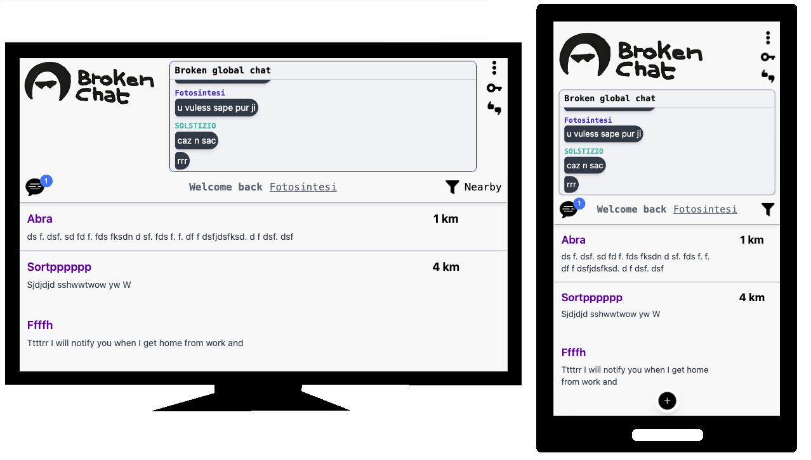

# Broken Chat

Una sistema di chat che puoi usare come vuoi, tutto sparira' se tutti escono!

**TODO**

- sistema di ban
- aggiungi lista utenti connessi e offline
- aggiungi allegati

STAVI FINENDO DI SISTEMARE LA HOME:
- sistemare la query adesso legge sia le mie chat e sia quelle vicine o popolari (nella query del server) (parlo del metodo principale che elenca tutto), forse bisogna fare un messaggio con "non sei ancora entrato in nessuna chat" quando vai nelle "mie chat"

mi piacciono i colori bg-gray-800 e bg-gray-700:

        {/* Input della chat */}
        <input
          type="text"
          placeholder="Scrivi un messaggio..."
          className="flex-1 p-2 bg-gray-700 text-white rounded-l-md"
        />
        
        {/* Bottone di invio */}
        <button className="ml-4 p-2 bg-blue-500 hover:bg-blue-700 text-white rounded-r-md">
          Invia
        </button>
      
